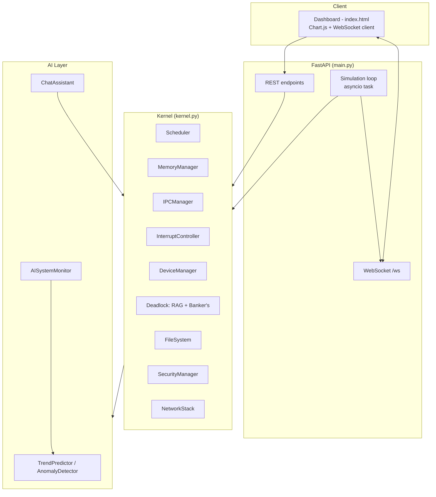
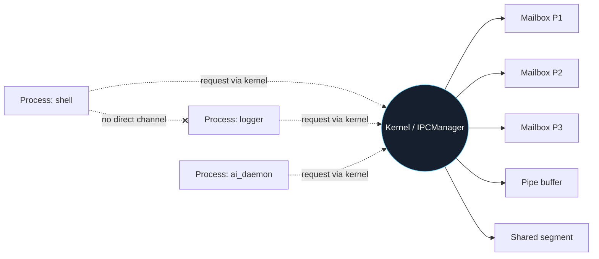
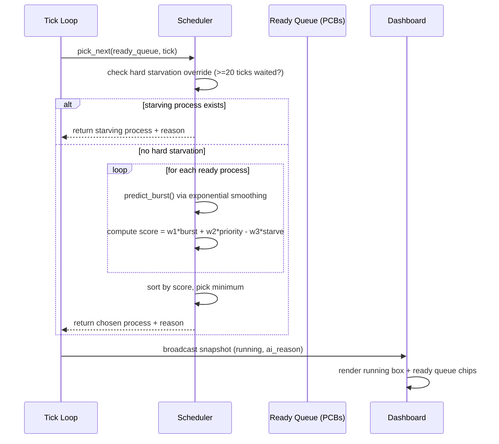
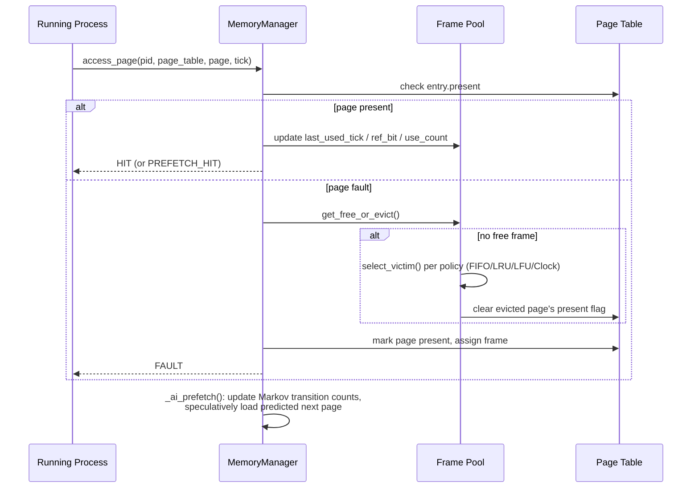
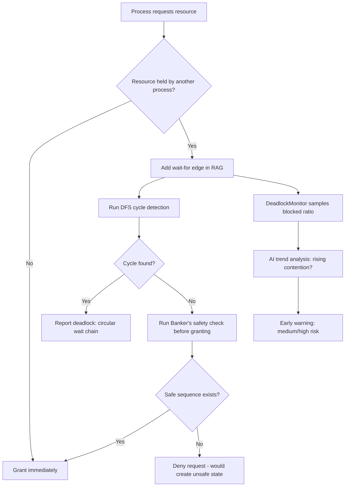
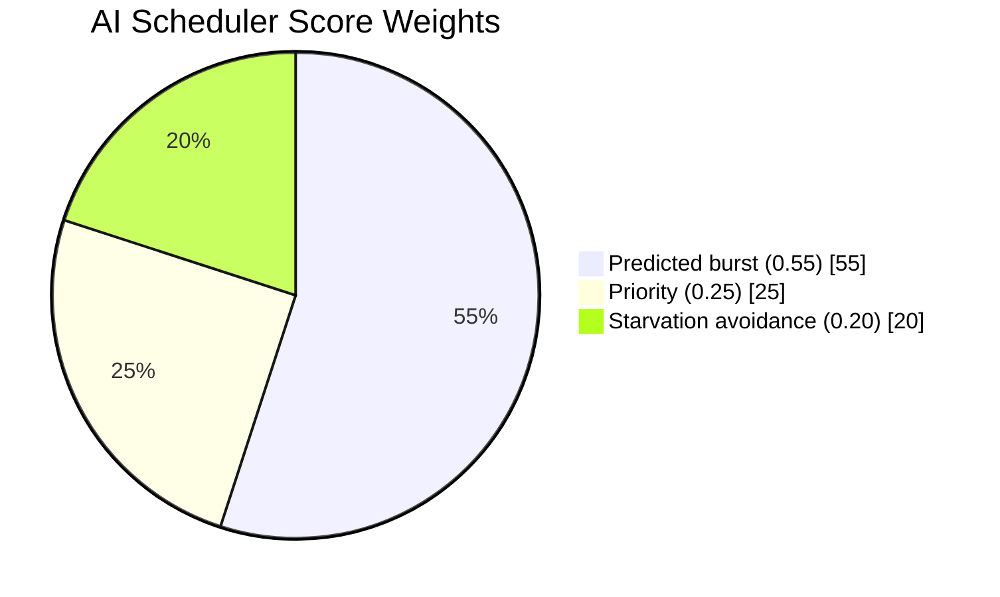
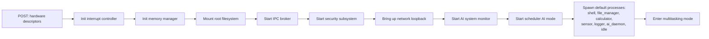
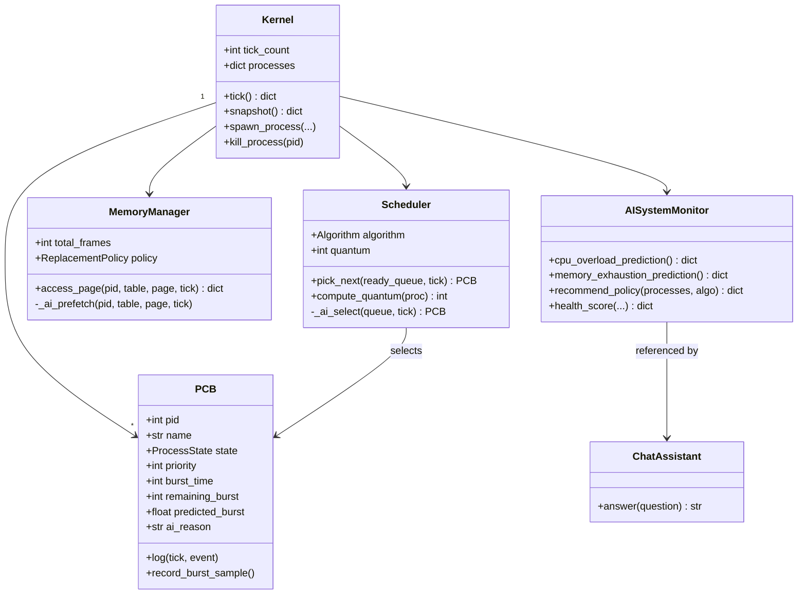

# Diagrams

All diagrams are Mermaid — render natively on GitHub, or paste into https://mermaid.live.

## 1. System architecture

## 2. Microkernel communication (IPC boundary enforcement)

*Processes never hold a reference to each other — every arrow terminates at the kernel's `IPCManager`, which is the architectural point of this diagram.*

## 3. Scheduling decision sequence (AI mode)

## 4. Memory access / page fault sequence

## 5. Deadlock detection flow

## 6. AI Scheduler decision-weight breakdown

## 7. Boot sequence

## 8. UML class overview (simplified)

